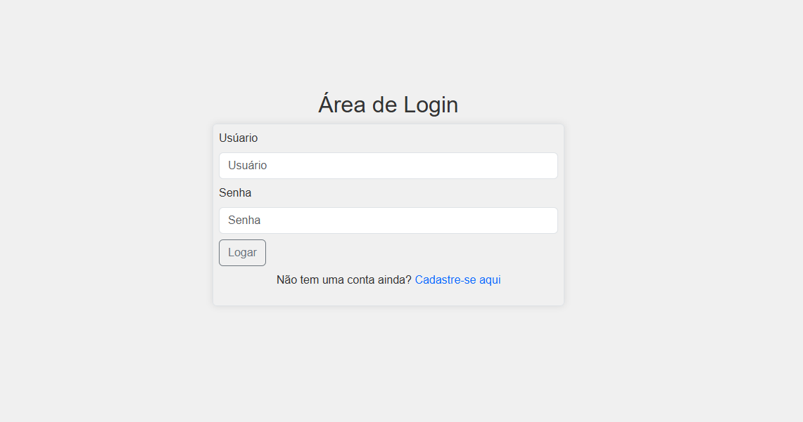
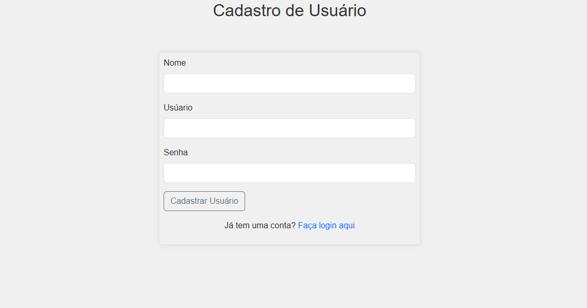
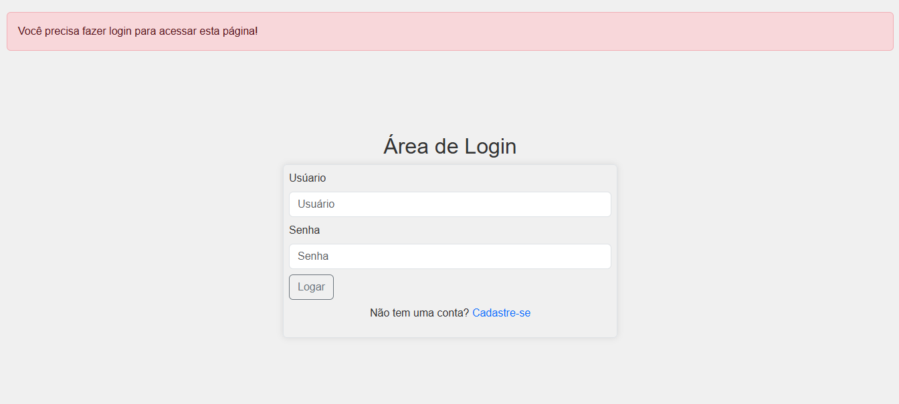
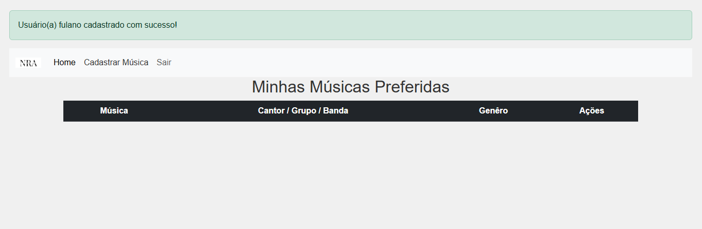
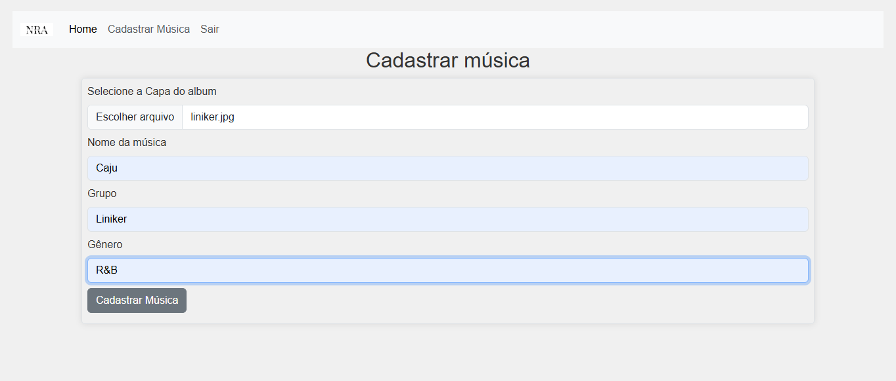
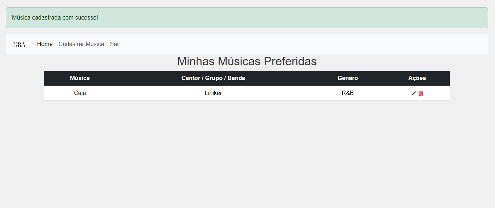
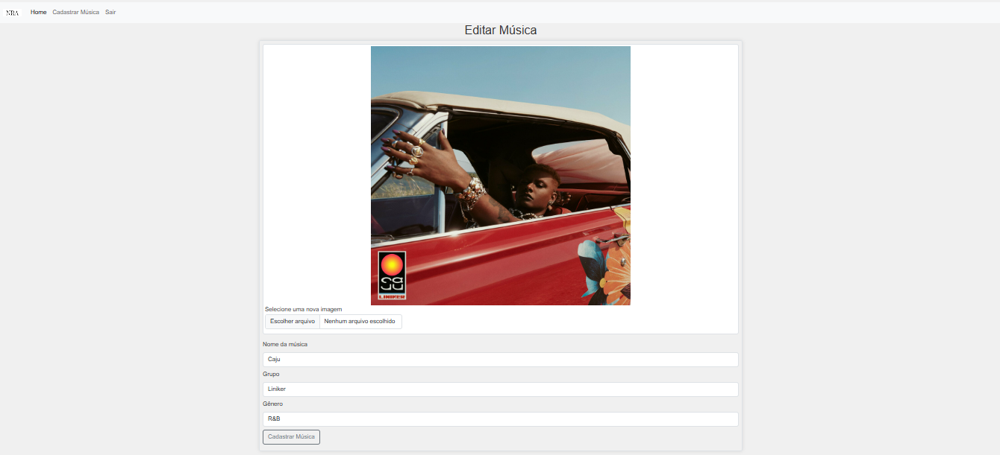

<h1>🎵Cadastro de Músicas</h1>

Projeto desenvolvido para cadastrar uma lista de suas músicas favoritas!

Permite adicionar, editar, excluir e fazer upload de uma imagem para cada música.

<h2>🚀 Tecnologias Usadas</h2>

<li>Python (Flask)</li>
<li>MySQL</li>
<li>SQLAlchemy</li>
<li>Bootstrap 5</li>
<li>HTML/CSS3</li>

<h2>🎯 Funcionalidades</h2>

<li>Adicionar novas músicas com nome, descrição e imagem.</li>
<li>Editar informações das músicas.</li>
<li>Excluir músicas do sistema.</li>
<li>Upload de imagem para cada música.</li>
<li>Listagem estilizada usando Bootstrap.</li>

<h2>📌Observações</h2>
<li>O upload de imagens é salvo localmente na pasta uploads/.</li>
<li>Arquivos sensíveis (.env) estão protegidos via .gitignore.</li>
<li>Projeto desenvolviddo para fins de estudo em Flask + MySQL</li>

<h2>📚 Aprendizados</h2>
<li>Integração Flask +  Banco de Dados Relacional.</li>
<li>Operações CRUD completas.</li>
<li>Upload e gerenciamento de arquivos no Flask.</li>
<li>Estruturção de projetos Web responsivos com Bootstrap.</li>

<h2>🧠 Próximos Passos (Ideias)</h2>
<li>Implementar autenticação de usuários.</li>
<li>Melhor validações nos formulários.</li>
<li>Deploy em produção (Render, Railway, etc).</li>

<h2>🖼️ Prints do Projeto</h2>

